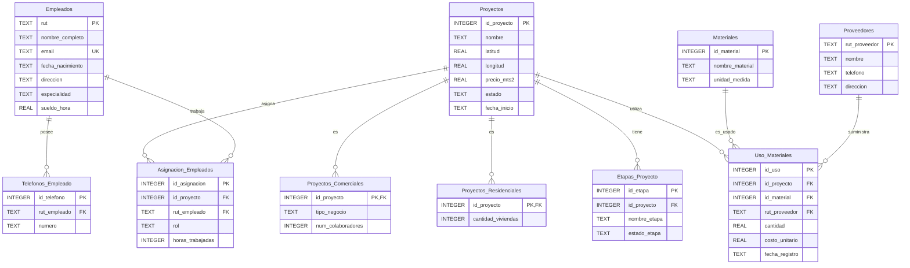

# Modelo Relacional — Entrega 2

El siguiente diagrama representa el esquema relacional implementado en SQLite 3, derivado del modelo Entidad-Relación aprobado en la Fase 1 (`proyecto/mer.md`).

## Descripción de tablas

| Tabla | Tipo | Clave primaria | Claves foráneas | Observación |
|-------|------|----------------|-----------------|-------------|
| `Empleados` | Fuerte | `rut` | — | Atributo `email` con restricción `UNIQUE`. |
| `Telefonos_Empleado` | Débil / multivaluado | `id_telefono` | `rut_empleado` → `Empleados(rut)` | Transformación del atributo multivaluado *teléfonos*. |
| `Proyectos` | Fuerte / superclase | `id_proyecto` | — | Contiene el discriminador implícito `estado`. |
| `Proyectos_Comerciales` | Subclase | `id_proyecto` | `id_proyecto` → `Proyectos(id_proyecto)` | Especialización con atributos propios. |
| `Proyectos_Residenciales` | Subclase | `id_proyecto` | `id_proyecto` → `Proyectos(id_proyecto)` | Especialización con atributos propios. |
| `Etapas_Proyecto` | Débil | `id_etapa` | `id_proyecto` → `Proyectos(id_proyecto)` | No tiene sentido sin su proyecto. |
| `Proveedores` | Fuerte | `rut_proveedor` | — | — |
| `Materiales` | Fuerte | `id_material` | — | — |
| `Asignacion_Empleados` | Asociativa (M:N) | `id_asignacion` | `id_proyecto`, `rut_empleado` | Relación entre empleados y proyectos. |
| `Uso_Materiales` | Asociativa (M:N) | `id_uso` | `id_proyecto`, `id_material`, `rut_proveedor` | Relación entre proyectos, materiales y proveedores. |
